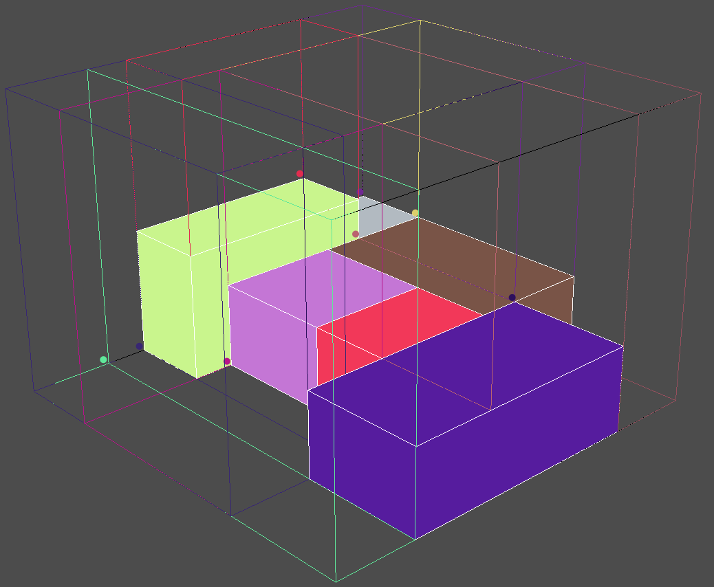

# 3d-bin-space-utilization

Square space utilization core for 3d bin packing algorithm

<strong>Important! Library does not provide any packing algorithm:</strong>  
 - Demo packing algorithm is only to overview code usage, it helps to start writing your own container packing algorithm.
 - java3d library and Draw3d class gives you quick look / development tool for your algorithm results.

Notes:
 - Coordinates for `Bin` starts at (`0,0,0`):[`length, height, width`] and goes till defined bin size.  
  
 - Each time, when you add `Cargo` to `Bin` you have to collect new `Bin.emptySpace()` list to know latest 
  situation of space distribution in `Bin`.  

 - Library does not restricts box overlapping, it provides view of all empty spaces to stack cargo.
  
 - In `Bin`, `Cargo` rotates at most to six positions.
 - Detailed info - Run demo code: `java -jar .\demo\target\demo-jar-with-dependencies.jar`

# Usage
- Clone repository
- Compile: `mvn clean install`
- Run: `java -jar .\demo\target\demo-jar-with-dependencies.jar`

## Todo:
- create demo packing algorithm
- released first version

## Preview

