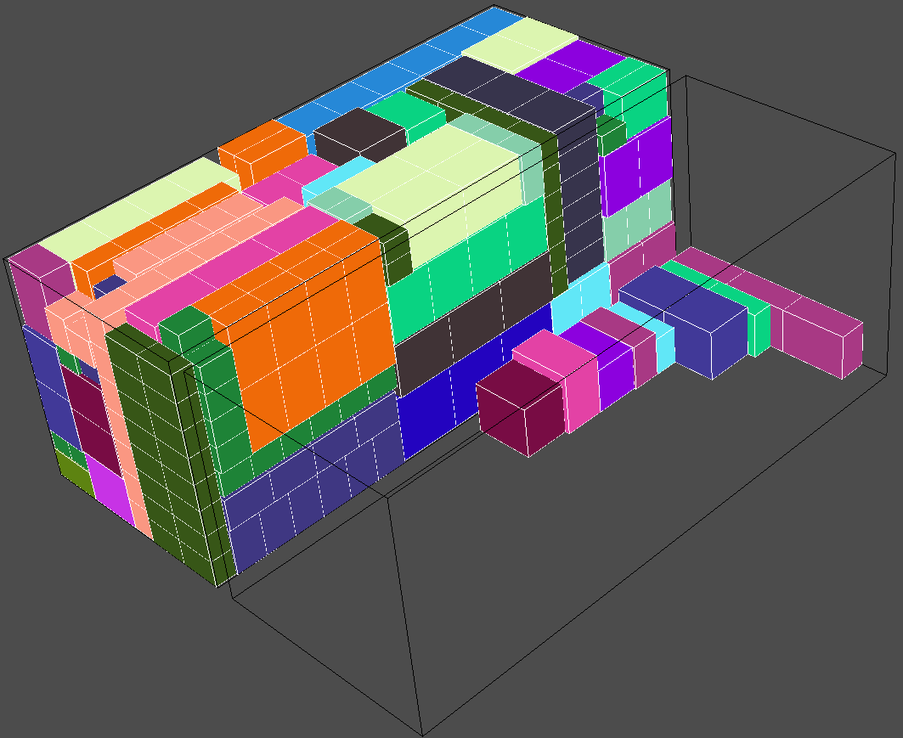

# 3d-bin-space-utilization

## Square space utilization core for 3d bin packing algorithm.

When starting to write algorithm for <strong>`3d Container loading software`</strong> it is hard to understand how to utilize space while adding cargo to it. I present you my algorithm of space utilization for 3d container packing software.

<strong>Important! Library does not provide useful packing algorithm:</strong>

- Demo packing algorithm is only to overview code usage, it helps to start writing your own container packing algorithm.
- Although it gives you solid results, each time it will give you different solution for the same problem.
- java3d library and Draw3d class gives you quick look / development tool for your algorithm results.

Notes:

- Coordinates for `Bin` starts at (`0,0,0`):[`length, height, width`] and goes till defined bin size.

- Each time, when you add `Cargo` to `Bin` you have to collect new `Bin.emptySpace()` list to know latest
  information of empty spaces in `Bin`.

- Core does not provide any restrictions when adding cargo, it provides information of empty spaces.

- Cargo can overlap if wrongly added.

- In `Bin`, `Cargo` rotates at most on six positions / sides.
  
- Detailed info - Run demo code.

# Usage

- Clone repository
- Compile: `mvn clean install`
- Run Demo: `java -jar .\demo\target\demo-jar-with-dependencies.jar`

## Todo:

- released first version

## Preview core

## Preview demo algorithm

5 types of items.

20 types of items.

