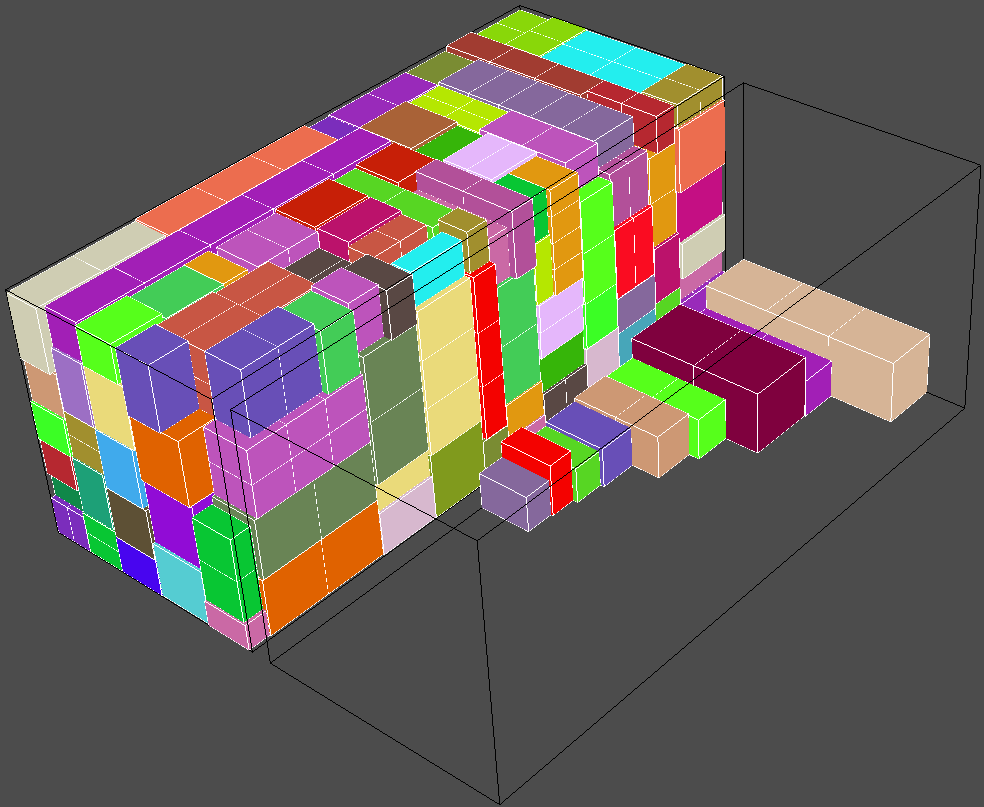
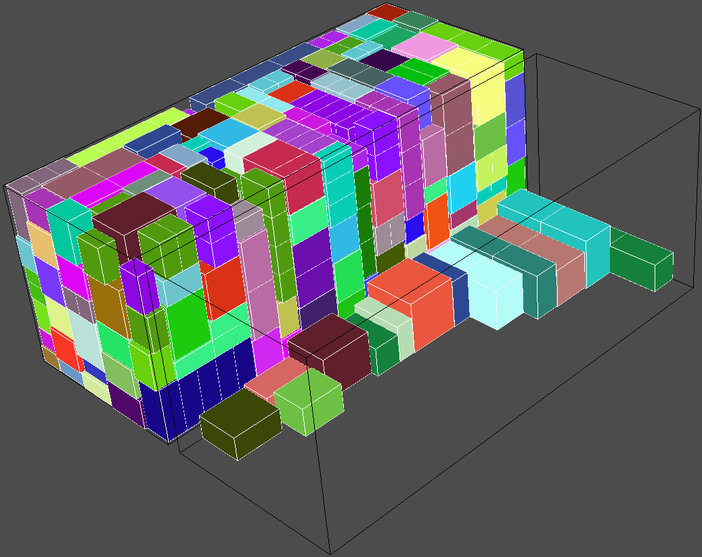

# 3d-bin-space-utilization

## Square space utilization core for 3d bin packing algorithm.

When starting to write algorithm for <strong>`3d Container loading software`</strong> it is hard to understand how to utilize space while adding cargo to it. I give you my algorithm / structure of space utilization for 3d container packing software.

- Demo packing algorithm gives you a very good results and understanding about code usage.
- Algorithm based on Random and little bit of magic :) Unfortunately, each time it will give you different solution for the same problem.
- java3d library and Draw3d class gives you quick look / development tool for your algorithm results.

Notes:

- Coordinates for `Bin` starts at (`0,0,0`):[`length, height, width`] and goes till defined bin size.

- Each time, when adding `Cargo` to `Bin` you have to create `new unmodifiable Bin` with added cargo to it (Example in demo algorithm).

- Core does not provide any restrictions when adding cargo, cargo can overlap, if not respected empty space.

- In `Bin`, `Cargo` rotates at most on six positions / sides.
  

- Detailed info
  - Run demo code.
  - Explore demo algorithm: https://github.com/Strauteka/3d-bin-space-utilization/blob/main/demo/src/main/java/org/strauteka/jbin/demo/algorithm PackerEntry.java class

# Usage

- Clone repository
- Compile: `mvn clean install`
- Run Demo: `java -jar .\demo\target\demo-jar-with-dependencies.jar`

# Requires

- Java 1.8
- Maven

## Preview core

### Empty space determination

### Over-stack space

## Preview demo algorithm

### 5 types of items.

### 20 types of items.

### 50 types of items.

### 100 types of items.

### Pallet support.

## Problems with `java3d` libraries?

You may find solution in java3d folder ;)
